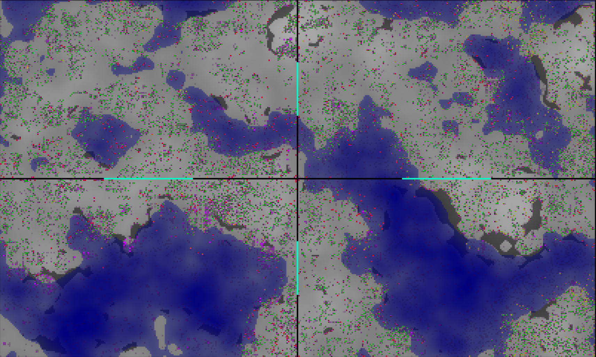

# Evolution simulator

My artificial life/evolution simulator.

Features of this simulator:
* Creatures
    * Can be herbavores, carnivores or omnivores, depending on one gene
    * Behaviour is defined by neural network
    * Neural network weights are defined by genes
    * Two-gendered and one-gendered creatures are supported
    * Gene recombination like in humans (diploid organisms, meiosis, cross over and stuff)
* World is generated procedurally.
* Implemented in python with highly efficient numpy operations
* Runs on multiple CPU cores
* Frontend in web browser

Screenshot:


In this screenshot:
* Areas
    * Grey - ground.
    * Blue - water (less energy for herbavores, higher movement cost).
    * Dark grey - rocks. Noone can go there.
* Dots
    * Green - herbavores. Get energy from nowhere.
    * Red - carnivores. Get energy from meat.
    * Yellow - (and other colors between green and red) omnivores. Get energy from nowhere, but less efficient. Get energy from meat same as carnivores. Weaker than carnivores (yes, they can fight).
    * Purple - meat, laying on the ground. Herbavores get less energy if there is a lot of meat.
* Splits
    * Map is split in 4 parts, each is run by a separate process.
    * Blue lines - portals. They are small so that there is not too much I/O between processes.
    * Processes are not syncronised. Time goes faster in places where there are less creatures.

## How to run
Start backend:

```
cd backend
python app_simple.py
```

Start frontend server:

```
cd frontend
npm run dev
```

Open http://127.0.0.1:3000 in your browser and watch the game play itself.

## To be made in future
* docker image
* more complicated game mechanics