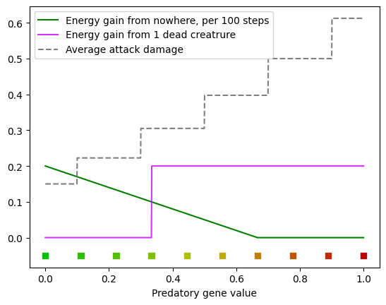

# Evolution simulator

My artificial life/evolution simulator.

Features of this simulator:
* Possibly smart creatures
    * Behaviour is defined by a recurrent neural network
    * Can be herbavores, carnivores or omnivores, depending on one gene
    * Neural network weights are defined by genes
    * Two-gendered and one-gendered creatures are supported
    * Gene recombination like in humans (diploid organisms, meiosis, cross over and stuff)
* Designed for Huge worlds
    * Simple grid based movement mechanics
    * Implemented in python with highly efficient numpy operations (both mechanics and rendering)
    * Runs on multiple CPU cores
    * World is generated procedurally
* Simple architecture
    * CLI backend in python
    * Web browser frontend in VUE.js

>Main future goals:
>* See population-level evolution instead of individial
>* See complicated behaviours (sexual reproduction, swarm intelligence)
>* Achieve this without any hard coded rules or restrictions

Screenshot:


In this screenshot:
* Area colors
    * Grey - ground.
    * Blue - water (less energy for herbavores, higher movement cost).
    * Dark grey - rocks. Noone can go there.
* Dots
    * Green - herbavores. Get a little energy from nowhere.
    * Red - carnivores. Get a lot of energy from meat.
    * Yellow (and other colors between green and red) - omnivores. Get energy from nowhere, but less efficient. Get energy from meat same as carnivores. Weaker than carnivores (yes, they can fight).
    * Purple - meat, laying on the ground. Herbavores get less energy if there is meat in their cell.
* Splits
    * Map is split in 4 parts, each is run by a separate [process](https://docs.python.org/3/library/multiprocessing.html#the-process-class).
    * Cyan lines - portals. Creatures can pass through them. Portals are made small in order to limit I/O between processes.
    * Processes are not syncronised. Time goes faster in places where there are less creatures.

> ### Performance
> The screenshot above has only 4 subworlds. There are around 12 000 creatures in total. In practice, there can be as many subworlds as the number of CPU's on the machine. Simulation with this many creatures usually runs at around 5-10 frames per second. Speed does not decrease when more subworlds are added (given enough CPU's).

## How to run
Start backend:

```
cd backend
python app_simple.py
```

Start frontend server:

```
cd frontend
npm run dev
```

Open http://127.0.0.1:3000 in your browser and watch the game play itself.

## More details on simulation rules

### Health and energy
Each creature starts with 1 health and 0.25 energy. Maximum of both variables is 1.

Health is restored automatically. Creatures start taking damage if they are old.

### Actions
Each step each creature performs one of 6 actions. Each action costs some amount of energy:
```
nothing         0.0
go forward      0.0
go backward     0.001
turn right      0.001
turn left       0.001
reproduce       0.5
*attack         0.06
```

### Fights
`attack` action is performed only when creature chooses to `go forward` but there is another creature in front. Creature cannot do `attack` separately.

When attacking, D&D rules are applied to compute hit/miss and damage. Creatures have 10 armor class. Damage roll is 1d4. Predators have +5 strength bonus, while herbavores have none. Damage is then multiplied by 0.1.

### Predatory
`predatory` is the first gene in any creature. It can have value from 0 to 1. Creature's color depends on `predatory`. This plot shows every parameter that depends on this gene:




## To be made in future
* docker image
* more complicated game mechanics